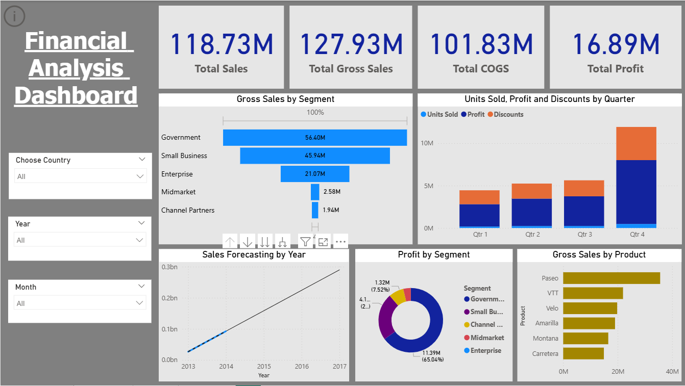

# Financial-Analysis-Dashboard-Power-BI-
Interactive Power BI financial dashboard to track revenue, expenses, profit, and sales trends.

## Overview
This project presents a **Financial Analysis Dashboard** built in Power BI to monitor and analyze key financial performance indicators. It provides insights into **revenue, gross sales, cost of goods sold (COGS), profit, and sales trends** to support data-driven decision making.

## Tools & Technologies
- Power BI  
- Microsoft Excel (dataset)  

## Dataset
The dashboard is based on sample financial transaction data, including revenue, COGS, profit, and customer segments.  
*Note: Only demo data is used – no confidential information included.*  

## Dashboard Preview
  

## Key Insights
- **Total Sales:** 118.73M  
- **Total Gross Sales:** 127.93M  
- **Total COGS:** 101.83M  
- **Total Profit:** 16.89M  
- Government and Small Business are the **top-performing segments**.  
- Sales forecasting shows a **consistent upward trend**.  
- **Quarter 4** contributes the highest sales and profit.  
- Products like **Paseo and VTT** generate the highest revenue.  

## Features
- KPI cards for quick financial performance snapshot  
- Segment-wise and product-wise breakdowns  
- Trend analysis with **sales forecasting**  
- Profitability analysis by segment and product  
- Interactive slicers for **Country, Year, and Month**  
- Automated reporting to minimize manual effort  

## Author
**Asmin Khan**  
📌 [LinkedIn](https://www.linkedin.com/in/asmin-khan-5a7bb732b/)
